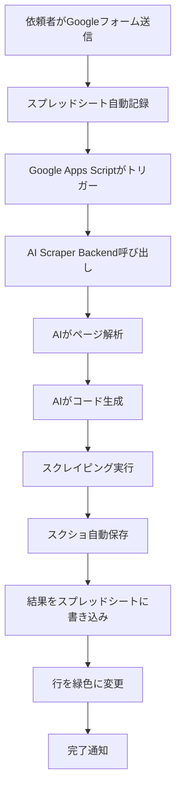

# 🔗 Googleスプレッドシート完全自動連携ガイド

**「依頼くる → コード生成 → 簡単に実行 → 結果をスクショ」を完全自動化!**

---

## 🎯 何ができるの?

### Before (手動作業)
```
1. Asanaで依頼を確認
2. AI Scraper Builderを開く
3. URLを入力して解析
4. コード生成
5. 実行
6. 結果をスクショして共有
7. Asanaに報告
```

### After (完全自動)
```
1. 依頼者がGoogleフォームを送信
   ↓ (全自動)
2. 完了! スプレッドシートに結果が届く
```

**担当者は何もしなくてOK!** ☕

---

## 🚀 自動化フロー



---

## 📋 スプレッドシートの構造

| 列 | 項目 | 入力方法 | 説明 |
|----|------|---------|------|
| A | 受付No | 自動 | フォーム送信時に自動採番 |
| B | タイムスタンプ | 自動 | フォーム送信日時 |
| C | 依頼者 | フォーム | 依頼者の名前 |
| D | 対象URL | フォーム | スクレイピング対象のURL |
| E | 目的 | フォーム | 何のためにクローリングするか |
| F | ステータス | 自動 | 新規受付→処理中→完了 |
| G | 担当者 | 手動 | (オプション) |
| H | 希望納期 | 自動 | タイムスタンプ+3営業日 |
| I | **取得件数** | **AI自動** | 🤖 AIが取得したデータ件数 |
| J | **スクショURL** | **AI自動** | 🤖 AIが保存したスクショのURL |
| K | **データURL** | **AI自動** | 🤖 取得データファイルのURL |
| L | **完了日時** | **AI自動** | 🤖 処理完了日時 |

---

## ⚙️ セットアップ

### ステップ1: バックエンドをデプロイ

#### 🎯 デプロイ方法を選択

| オプション | コスト | セットアップ時間 | おすすめ |
|-----------|-------|----------------|---------|
| **AWS Lambda** | 無料〜$5/月 | 10分 | ⭐⭐⭐⭐⭐ 本番向け |
| **Render.com** | 無料〜$7/月 | 5分 | ⭐⭐⭐⭐ 最も簡単 |
| **AWS ECS** | $15〜30/月 | 30分 | ⭐⭐⭐⭐ 大規模向け |
| **AWS EC2** | 無料〜$8/月 | 20分 | ⭐⭐⭐ 開発向け |

詳細は [AWS_DEPLOYMENT.md](./deployment/AWS_DEPLOYMENT.md) を参照

---

#### オプションA: AWS Lambda (推奨)

**メリット**: 月100万リクエスト無料、自動スケーリング

```bash
cd backend
npm install -g serverless
npm install serverless-http @sparticuz/chromium playwright-core

# serverless.ymlを作成（詳細はAWS_DEPLOYMENT.md参照）

# デプロイ
export AWS_ACCESS_KEY_ID=your_key
export AWS_SECRET_ACCESS_KEY=your_secret
serverless deploy
```

デプロイ後、URLが表示されます:
```
https://xxxxxxxx.execute-api.ap-northeast-1.amazonaws.com/prod
```

---

#### オプションB: Render.com (最も簡単)

**メリット**: 5分でデプロイ完了、無料枠あり

1. [Render.com](https://render.com/)にサインアップ

2. **New Web Service**をクリック

3. GitHubリポジトリを接続

4. 設定:
   - **Name**: `ai-scraper-backend`
   - **Root Directory**: `backend`
   - **Build Command**: `npm install && npx playwright install chromium`
   - **Start Command**: `npm start`

5. 環境変数を追加:
   ```
   GEMINI_API_KEY=your_gemini_api_key
   PORT=3000
   NODE_ENV=production
   DEFAULT_TIMEOUT=180000
   ```

6. **Create Web Service**をクリック

7. デプロイ完了後、URLをコピー (例: `https://ai-scraper-xxxxx.onrender.com`)

---

#### オプションC: AWS ECS Fargate (本番・大規模向け)

**メリット**: 長時間処理対応、安定性高い

詳細手順は [AWS_DEPLOYMENT.md](./deployment/AWS_DEPLOYMENT.md#オプション2-ecs-fargate-docker) を参照

---

#### オプションD: AWS EC2 (シンプル)

**メリット**: SSH接続可能、デバッグしやすい

詳細手順は [AWS_DEPLOYMENT.md](./deployment/AWS_DEPLOYMENT.md#オプション3-ec2-従来型) を参照

### ステップ2: Google Apps Scriptをセットアップ

1. **Googleスプレッドシート**を開く

2. **拡張機能 → Apps Script**

3. `/google-apps-script/AutoScraper.gs`の内容を全てコピペ

4. **CONFIG.BACKEND_URL**を変更:
   ```javascript
   BACKEND_URL: 'https://ai-scraper-xxxxx.onrender.com'
   ```

5. **保存** (Ctrl+S)

### ステップ3: トリガーを設定

#### 自動実行トリガー

1. Apps Script画面で**トリガー**アイコン (⏰) をクリック

2. **トリガーを追加**

3. 設定:
   - **実行する関数**: `onFormSubmit`
   - **イベントのソース**: `スプレッドシートから`
   - **イベントの種類**: `フォーム送信時`

4. **保存**

#### 定期チェックトリガー (オプション)

「新規受付」を5分おきに自動処理:

1. 再度**トリガーを追加**

2. 設定:
   - **実行する関数**: `processNewRequests`
   - **イベントのソース**: `時間主導型`
   - **間隔**: `5分おき`

3. **保存**

### ステップ4: Google Sheets API有効化 (書き込み機能用)

#### サービスアカウント作成

1. [Google Cloud Console](https://console.cloud.google.com/)

2. プロジェクトを作成

3. **APIとサービス → ライブラリ**

4. **Google Sheets API**を検索して有効化

5. **認証情報 → サービスアカウント作成**

6. JSONキーをダウンロード

7. `/backend/credentials/google-credentials.json`として保存

8. `.env`に追加:
   ```env
   GOOGLE_CREDENTIALS_PATH=./credentials/google-credentials.json
   ```

9. スプレッドシートをサービスアカウントと共有 (編集権限)

---

## 📱 使い方

### 方法1: フォーム送信で完全自動 (推奨)

1. Googleフォームを作成して公開

2. 依頼者がフォームを送信

3. **あとは何もしなくてOK!** ☕

4. 数分後、スプレッドシートを確認:
   - ステータス: `完了` (緑色)
   - 取得件数、スクショ、データURLが記入済み

### 方法2: 手動実行ボタン

1. スプレッドシートのメニューに **🤖 AI Scraper**が表示される

2. **選択行を実行**をクリック

3. 実行したい行番号を入力

4. スクレイピング開始!

### 方法3: 手動でURL追加 → 自動実行

1. スプレッドシートに直接行を追加

2. ステータスを`新規受付`に設定

3. 5分以内に自動実行される

---

## 🔧 トラブルシューティング

### ❌ 「処理中」のまま動かない

**原因**: バックエンドに接続できていない

**解決策**:
1. メニュー **🤖 AI Scraper → テスト実行**
2. `CONFIG.BACKEND_URL`が正しいか確認
3. Renderのログを確認

### ❌ スクショが保存されない

**原因**: Google Drive連携が必要

**解決策**:
1. ローカル保存の場合: `/data/screenshots/`フォルダを確認
2. Google Drive保存の場合: `SheetIntegration.js`を拡張

### ❌ スプレッドシートに書き込めない

**原因**: Google Sheets APIの認証エラー

**解決策**:
1. サービスアカウントを作成
2. JSONキーを配置
3. スプレッドシートを共有

---

## 🎨 カスタマイズ例

### スクショをGoogle Driveに保存

`backend/src/services/SheetIntegration.js`を編集:

```javascript
async uploadScreenshot(screenshotBuffer, fileName) {
  const drive = google.drive({ version: 'v3', auth: this.auth });

  const fileMetadata = {
    name: fileName,
    parents: ['YOUR_FOLDER_ID'] // DriveのフォルダID
  };

  const media = {
    mimeType: 'image/png',
    body: Readable.from(screenshotBuffer)
  };

  const file = await drive.files.create({
    resource: fileMetadata,
    media: media,
    fields: 'id, webViewLink'
  });

  return file.data.webViewLink;
}
```

### Slack通知を追加

`backend/src/server.js`の`/api/auto-scrape`に追加:

```javascript
// 成功時にSlack通知
await axios.post(process.env.SLACK_WEBHOOK_URL, {
  text: `✅ スクレイピング完了!\n対象: ${url}\n取得件数: ${dataCount}`
});
```

---

## 📊 新しいAPIエンドポイント

### POST `/api/webhook/sheet`
スプレッドシートからのWebhook受信

**Request:**
```json
{
  "spreadsheetId": "1abc...",
  "rowNumber": 5,
  "targetUrl": "https://example.com",
  "purpose": "商品情報の収集",
  "requestNo": "REQ-001"
}
```

### POST `/api/auto-scrape`
完全自動パイプライン実行

**Request:**
```json
{
  "url": "https://example.com",
  "spreadsheetId": "1abc...",
  "rowNumber": 5
}
```

**Response:**
```json
{
  "success": true,
  "scraperId": "scraper_123",
  "analysis": {
    "statusCode": 200,
    "elementsFound": 15
  },
  "execution": {
    "dataCount": 50,
    "outputFile": "/data/outputs/result_123.json"
  },
  "screenshot": "file:///data/screenshots/screenshot_123.png",
  "timestamp": "2025-01-15T10:30:00Z"
}
```

---

## 🔐 セキュリティ対策

1. **APIキーの保護**
   - `.env`ファイルをGitにコミットしない
   - Renderの環境変数で管理

2. **スプレッドシートのアクセス制限**
   - 必要な人だけに共有
   - 閲覧専用/編集権限を適切に設定

3. **Webhook認証 (推奨)**
   ```javascript
   // server.jsに追加
   const WEBHOOK_SECRET = process.env.WEBHOOK_SECRET;

   app.post('/api/webhook/sheet', (req, res) => {
     if (req.headers['x-webhook-secret'] !== WEBHOOK_SECRET) {
       return res.status(401).json({ error: 'Unauthorized' });
     }
     // ...
   });
   ```

---

## 💡 運用Tips

### 定期バックアップ

1. Googleスプレッドシートの**ファイル → コピーを作成**
2. 毎週バックアップを取る

### ログ監視

1. **Renderダッシュボード → Logs**で確認
2. エラーが出たらSlack通知を設定

### コスト最適化

- **Render無料プラン**: 月750時間無料
- 使わない時間はスリープする (15分後に自動スリープ)
- 有料プラン ($7/月) でスリープなし

---

## 🎉 完成!

これで、**「依頼が来る → 自動でコード生成・実行 → 結果がスクショと共にスプレッドシートに届く」**が実現できました!

もう手動でスクレイピングする必要はありません。コーヒーを飲んでいる間に、AIが全部やってくれます ☕🤖

---

## 📞 サポート

詳細なセットアップ手順は:
- **バックエンド**: `/README.md`
- **Google Apps Script**: `/google-apps-script/README.md`

問題が発生した場合:
1. Renderのログを確認
2. Apps Scriptの実行ログを確認
3. メニューの**テスト実行**で接続確認
